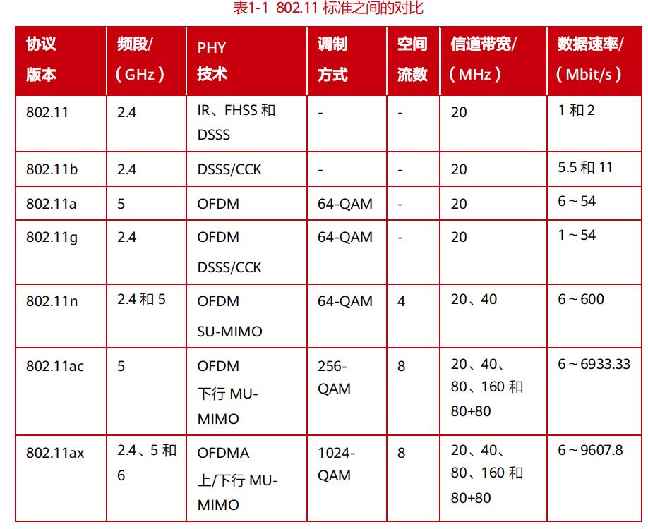

### Wi-Fi 6 MCS 表(码率+QAM调制方式)详解

下表总结了Wi-Fi 6（802.11ax）在单空间流下最常用的MCS索引及其关键参数：

| MCS 索引 | 调制方式 | 码率 | 每个子载波的有效比特数 | **备注与特点** |
| :--- | :--- | :--- | :--- | :--- |
| **MCS 0** | BPSK | 1/2 | 0.5 | **最基本、最鲁棒的模式** |
| **MCS 1** | QPSK | 1/2 | 1.0 | |
| **MCS 2** | QPSK | 3/4 | 1.5 | |
| **MCS 3** | 16-QAM | 1/2 | 2.0 | |
| **MCS 4** | 16-QAM | 3/4 | 3.0 | |
| **MCS 5** | 64-QAM | 2/3 | 4.0 | |
| **MCS 6** | 64-QAM | 3/4 | 4.5 | |
| **MCS 7** | 64-QAM | 5/6 | 5.0 | **802.11ac的最高常用速率** |
| **MCS 8** | 256-QAM | 3/4 | 6.0 | |
| **MCS 9** | 256-QAM | 5/6 | 6.67 | |
| **MCS 10** | 1024-QAM | 3/4 | 7.5 | **Wi-Fi 6 新增，中等强度纠错** |
| **MCS 11** | 1024-QAM | 5/6 | 8.33 | **Wi-Fi 6 的典型最高速率** |
| **MCS 12** | 1024-QAM | 3/4 (Low Density Parity Check Code) | 7.5 | 使用更强的LDPC编码，可靠性更高 |
| **MCS 13** | 1024-QAM | 5/6 (Low Density Parity Check Code) | 8.33 | 使用更强的LDPC编码，可靠性更高 |

**WiFi标准**

**在2.4 GHz频段下，一个OFDM符号通常有64个子载波**

---

### 1. 802.11a / 802.11g

这是OFDM技术在WiFi中最早普及的标准。

- **总子载波数：** **64**
- **有效子载波分配：**
    - **数据子载波：** 48个（用于传输实际数据）
    - **导频子载波：** 4个（用于跟踪相位和频率偏移）
    - **直流子载波：** 1个（中心子载波，通常不使用，以避免直流偏置影响）
    - **保护子载波/空子载波：** 11个（左右两边，用于频谱成型，减少邻道干扰）
- **总结：** 对于802.11a/g，我们常说它有 **52个“有效”子载波**（48个数据 + 4个导频），但它们共同存在于一个64点的FFT之中。

---

### 2. 802.11n

802.11n同时在2.4 GHz和5 GHz频段工作，它在20 MHz信道带宽下**沿用**了与11a/g相同的子载波结构，这是为了保持后向兼容。

- **20 MHz信道：**
    - **总子载波数：** **64**
    - **数据子载波：** 52个
    - **这是2.4 GHz下最常见的模式。**

- **40 MHz信道（2.4 GHz下不推荐）：**
    - 802.11n引入了信道绑定技术，将两个20 MHz信道绑定成一个40 MHz信道。
    - **总子载波数：** **128**
    - **数据子载波：** 108个
    - **注意：** 在拥挤的2.4 GHz频段，使用40 MHz信道非常不友好，因为它会几乎占满整个频段，并极易与其他WiFi网络产生冲突。因此，在实际部署中，2.4 GHz下通常强制使用20 MHz模式。

---

### 3. 802.11ax

802.11ax是旨在提高效率的新一代标准，它引入了更长的FFT周期，以使子载波间隔更窄，从而更好地对抗多径效应。

- **20 MHz信道：**
    - **总子载波数：** **256**（是传统标准的4倍）
    - **数据子载波：** 234个
    - **导频子载波：** 8个
    - **空子载波：** 其余
    - 虽然总子载波数变多了，但每个子载波的间隔从312.5 kHz减小到了78.125 kHz，符号持续时间也成倍增加。

---

### 对比

| WiFi 标准 | 信道带宽 | 总子载波数 | 数据子载波数 | 备注 |
| :--- | :--- | :--- | :--- | :--- |
| **802.11a/g** | 20 MHz | **64** | 48 | 2.4 GHz的经典模式 |
| **802.11n** | 20 MHz | **64** | 52 | 2.4 GHz下最常见，兼容11a/g |
| **802.11n** | 40 MHz | 128 | 108 | **2.4 GHz下不推荐使用** |
| **802.11ac** | 20/40/80/160 MHz | 64/128/256/512 | 变多 | **仅工作在5 GHz**，不在2.4 GHz |
| **802.11ax** | 20 MHz | **256** | 234 | 2.4 GHz的新一代高效模式 |

Wi-Fi 6 中，以
20MHz 信道为例，20MHz 信道被划分成 256 个子载波，子载波间隔从 Wi-Fi 5 的
312.5kHz 减小到 78.125kHz。其中用于数据传输的数据子载波（Data Tones）数量
为 234，在中心位置作为标识的直流子载波（DC Tones）数量为 7，用于信道估计等
功能的导频子载波（Pilot Tones）数量为 4，用于保护间隔的边带保护子载波
（Guard Tones）数量为 11

6 |(导频) 26 26 |(导频) 26 26 13 7(DC) 13 26 26 |(导频) 26 26 |(导频) 5